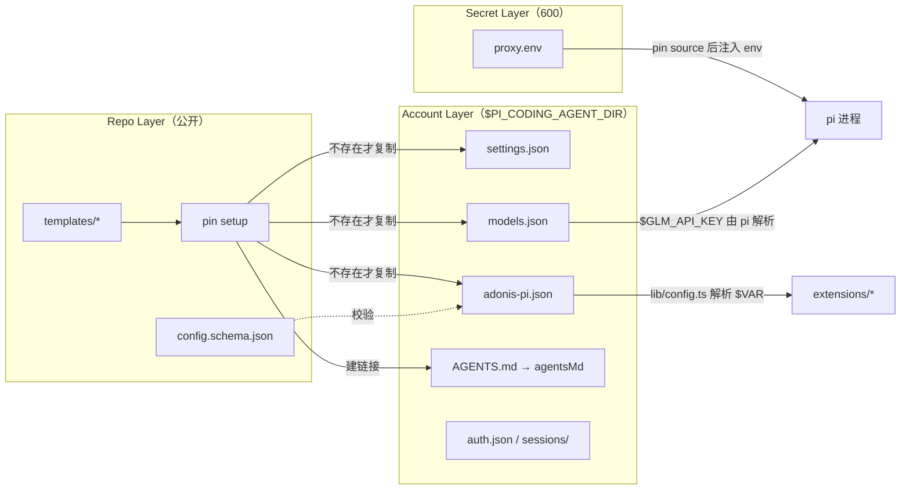
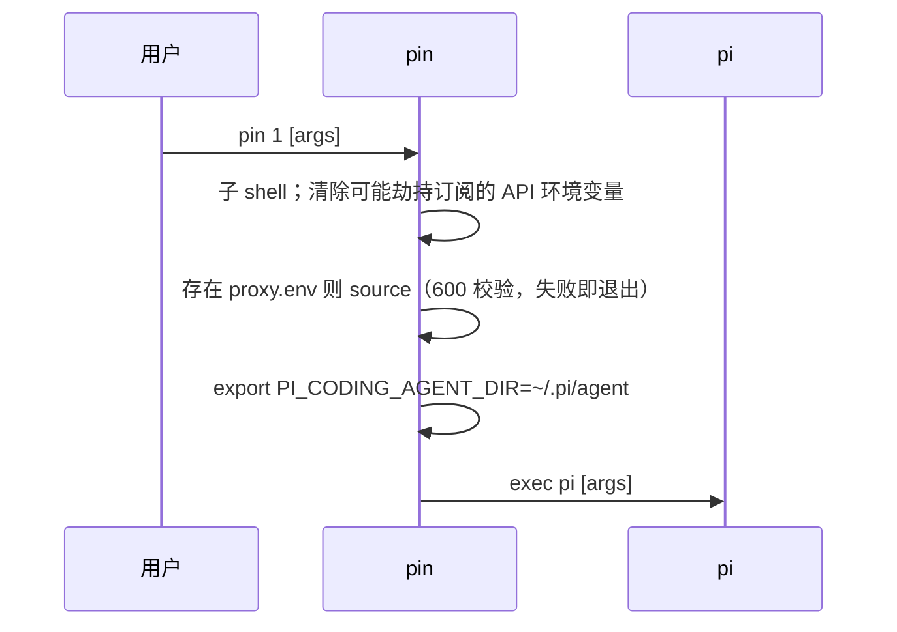

# adonis-pi 第一阶段设计

日期：2026-09-22 · 状态：已评审并经 Codex / Grok Build 顾问审阅（2026-09-22），进入实施（plan 见 `../plans/2026-09-22-adonis-pi-phase1.md`） · 术语见 `../../CONTEXT.md` · 决策见 `../adr/`

## 1. 目标

让 pi 成为第四个日常可用的 Host。判定标准是一条 Verification Task：在用户日常主仓里，用 pi 完成「读代码、改代码、跑测试、走 commit skill」，中途危险命令被拦、等待输入时收到提醒、skill 里的提问能弹出来。

## 2. 范围

### 做

| 编号 | 能力 | 实现方式 | 落点 |
|---|---|---|---|
| P1 | 共享规则文件 | `~/.pi/agent/AGENTS.md` 链接到 Config 里 `agentsMd` 指向的文件 | `pin setup` |
| P2 | 共享 skill | pi 默认读 `~/.agents/skills`，零改动 | 无 |
| P3 | Permission Gate | Extension，监听 `tool_call` | `extensions/permission-gate/` |
| P4 | Attention Notify | Extension，监听 `tool_result`（记活动）与 `agent_settled`（终态），调用 Notifier | `extensions/attention-notify/` |
| P5 | Ask Tool | Extension，注册工具 `AskUserQuestion` | `extensions/ask-user-question/` |
| P6 | Provider | `templates/models.json` 配 GLM；Kimi 用 pi 内建 `kimi-coding`（读 `KIMI_API_KEY`）；ChatGPT 订阅走 pi 自带 `/login` | `pin setup` |
| P7 | Launcher | `bin/pin`：launch / setup / doctor | `bin/pin` |
| P8 | Startup Check | Extension，`session_start` 时核对 `models.json` 引用的 `$VAR` 是否在环境里，缺则提示改用 `pin` 启动 | `extensions/startup-check/` |

### 不做（第二阶段候选）

- MCP 客户端桥（figma、kimi-cu 是真实缺口，deepwiki / github 用量极低可不做）
- sub-agent / 任务委派
- plan / todo 工具
- 多账号目录（`~/.pi-002` 起）接入 `acc`
- Prompt Template、Theme

## 3. 架构

### 3.1 目录

```
adonis-pi/
├── package.json              # "pi": { "extensions": [显式文件列表] }
├── bin/pin                   # Launcher，POSIX sh
├── config.schema.json        # adonis-pi.json 的 JSON Schema
├── templates/
│   ├── settings.json         # packages 指向本仓；defaultProvider/defaultModel 占位
│   ├── models.json           # GLM provider，apiKey 用 $VAR（Kimi 走 pi 内建 kimi-coding）
│   └── adonis-pi.json        # extension 的默认配置
├── lib/
│   ├── config.ts             # loadConfig()：读 $PI_CODING_AGENT_DIR/adonis-pi.json，校验 schema，解析 $VAR
│   └── notify.ts             # notify(kind, payload)：组装 Notifier 期望的 JSON 并异步调用
├── extensions/
│   ├── permission-gate/index.ts
│   ├── attention-notify/index.ts
│   ├── ask-user-question/index.ts
│   └── startup-check/index.ts
├── tests/                    # node --test，每个 extension 一个文件，用 pi 的 ExtensionAPI 假对象驱动
├── CONTEXT.md
└── docs/{specs,adr,plans}/
```

`package.json` 的 `pi.extensions` 列出显式文件路径，不依赖目录自动发现对子目录 `index.ts` 的支持（该行为 `UNVERIFIED`）。

### 3.2 配置三层（ADR 0002）



### 3.3 `adonis-pi.json`（Config）

```json
{
  "$schema": "https://raw.githubusercontent.com/Adonis0123/adonis-pi/main/config.schema.json",
  "agentsMd": "~/path/to/shared/AGENTS.md",
  "permissionGate": {
    "mode": "ask",
    "denyCommands": [
      "^\\s*(\\w+=\\S*\\s+)*((env|command|exec|nohup|time)\\s+)*sudo\\b",
      "^\\s*rm\\s+(\\S+\\s+)*(/|~|\\$HOME)(/\\*)?/?(\\s|$)",
      "^\\s*git\\s+(-C\\s+\\S+\\s+)?push\\b.*(\\s(--force|--force-with-lease)\\b|\\s-[a-zA-Z]*f[a-zA-Z]*\\b|\\s\\+\\S+)",
      "^\\s*chmod\\s+(-R\\s+)?0?777\\b",
      "^\\s*dd\\s+if="
    ],
    "protectedPaths": ["~/.ssh/**", "~/.aws/**"]
  },
  "notify": {
    "command": "$ADONIS_PI_NOTIFY_CMD",
    "kinds": { "confirm": true, "fail": true, "idle": false },
    "idleDelaySeconds": 60
  },
  "askUserQuestion": {
    "enabled": true
  }
}
```

- `agentsMd` 是本机路径，属于 Account Layer，所以出现在这里而不是仓里。Template 里该字段为空字符串，`pin setup` 若发现为空则提示填写。
- `permissionGate.denyCommands` 默认值复刻用户在 Claude Code `settings.json` 里的 deny 列表，这是通用规则，可以进仓。匹配前先把命令按换行、`;`、`&&`、`||`、`|` 切成片段，并把 `sh -c '…'` / `bash -c "…"` 的引号内容也作为片段，每条正则逐片段匹配，所以正则都以 `^\s*` 开头即可。
- `notify.command` 用 `$VAR` 间接引用，Notifier 的真实路径由 `proxy.env` 或 shell 环境提供，不进仓。
- `notify.kinds.idle` 只能在 `confirm` 为真时开启：Notifier 从同一个 Stop 事件判定 confirm 还是 idle，关掉 confirm 就没有 Stop 可发。


Config 的加载规则（2026-09-22 架构评审后）：

- 账号文件与 Template 逐键合并：对象按键合并，**数组追加**（账号加一条 `denyCommands` 不会丢掉默认 5 条，重复项去掉），标量覆盖。
- 任意深度的未知键都报错（`unknown key "notify.kinds.confrim"`），拼错不会静默变成默认值。`pin doctor` 用同一个校验器，无效文件报 FAIL。
- Extension 通过 `lib/session.ts` 取 Config；文件 mtime 或大小变化即重读，改完 `adonis-pi.json` 不用重启 pi。文件损坏时退回 Template，并在有 UI 时提示一次。
- 因为是合并，账号层的 `adonis-pi.json` 只保存覆盖项：`pin setup` 生成 `{ "$schema", "agentsMd": "" }`，不复制整份 Template（否则数组追加会让旧规则永远留在账号里）。`pin doctor` 对它做校验而不做 Drift。
- Drift 只报「Template 有、账号没有」的键；账号多出来的键（`theme`、`skills`、pi 自己写的 `lastChangelogVersion`）是正常的，不报。

### 3.4 `pin`（Launcher）

```
pin [n] [pi 参数...]      启动第 n 号 Account（不写 n 就是 1；n=1 → ~/.pi/agent；n≥2 → ~/.pi-00n/agent），所以 `alias pi=pin` 后 `pi -p "…"` 照常可用
pin setup <n>             建目录；复制缺失 Template；建 AGENTS.md 链接；在 settings.json 的 packages 注册本仓路径
pin doctor <n>            检查：proxy.env 权限 600、Template Drift、adonis-pi.json 通过真实校验器、AGENTS.md 链接有效、packages 含本仓且各项在磁盘上存在、models.json 与生效 Config 引用的 $VAR 在 proxy.env 中存在、pi --version 属于 0.87.x（否则 WARN）
```

`bin/pin` 是 POSIX sh，只做 sh 才能做的事：source `proxy.env` 进环境、`exec pi`。账号目录布局、Template 列表、`$VAR` 语法、setup 与 doctor 全在 `bin/lib/account.ts`，它直接 import `lib/config.ts`，由 Node ≥ 22.18 以 type stripping 运行（`pin` 启动前检查 Node 版本）。这样 Launcher 与 Extension 不会各存一份布局知识。

启动序列，和 `acc` 的 `_acc_launch` 同构：



`pin` 只做目录与环境，不碰 pi 的 `auth.json`。`n=1` 映射主目录，和 `codex001 = ~/.codex` 的既有约定一致。

### 3.5 四个 Extension

**permission-gate**

- 监听 `tool_call`。对 `bash` 把 `input.command` 切片段后逐条匹配 `denyCommands`；对 `write` / `edit` 检查 `input.path`（相对路径按 `ctx.cwd` 解析，`~` 展开）是否命中 `protectedPaths`。
- `mode: "ask"`：Surface 的 `canPrompt` 为真时 `ctx.ui.confirm` 询问，否则 `{ block: true, reason }`。`mode: "block"`：一律阻止。
- 询问前经 Session 报一条 `permission` 事件（由 Session 决定是否叫 Notifier），载荷只带命令前 200 字或路径，不带完整 `tool_input`。
- `git push` 规则对带 `--dry-run` 的命令放行（2026-09-22 用户要求放宽）。
- 片段切分：换行、`;`、`&&`、`||`、`|`、`&`、`(`、`)`、`$(`，去掉片段开头的 `if/then/else/elif/do/while/until/time/!`，`sh -c '…'` 的引号体递归切分。`rm` 规则接受 `"$HOME"`、`${HOME}`、`'~'` 这类写法。
- **定位是防误操作，不是安全隔离**：不拦 `read` 与 `cat ~/.ssh/...` 这类读取，不解析 shell 变量、别名和 `eval`，不处理 symlink，也不解析引号（`echo "a | sudo b"` 会多弹一次确认）。需要隔离时用容器或 pi 文档里的沙箱方案。
- 与 pi 官方 `permission-gate.ts` 的差别：规则来自 Config 而不是硬编码；增加路径保护与片段化匹配。

**attention-notify**

- 三个 Extension 都只向 Session 报「发生了什么」（`question` / `permission` / `settled` / `activity`），`lib/session.ts` 决定要不要叫 Notifier、发什么载荷；`lib/notify.ts` 只剩载荷组装与 spawn 适配器（见 §3.7）。`extensions/attention-notify/` 只把 `tool_result` 与 `agent_settled` 转成事件。
- 事件到 Notifier JSON 的映射（Notifier 已按 `--agent <name>` 通用处理宿主名，无需改脚本本体）：

| 来源 | Notifier 事件 JSON | Notifier 侧结果 |
|---|---|---|
| Ask Tool 开始等待 | `PreToolUse` + `tool_name: "AskUserQuestion"` + `tool_input.questions` | confirm |
| Permission Gate 开始询问 | `PermissionRequest` + `tool_name` + `tool_input.command` | confirm |
| `agent_settled` 且分支里最后一条 assistant 消息 `stopReason === "error"` | `StopFailure` + `error` 映射码（401/403 → `authentication_failed`，额度 → `billing_error`，模型不存在 → `model_not_found`；其余不发） | fail |
| `agent_settled` 正常结束（`stopReason` 不是 `aborted`） | `Stop` + `last_assistant_message` | Notifier 自己判定「需要你拍板」/ 问题轮 / 句尾问号 → confirm，否则 idle（默认关） |
| 每次 `tool_result` | `PostToolUse` + `--mark` | 只记活动 |

- 只听 `agent_settled`，不听 `agent_end`：后者在自动重试、压缩、续跑前都会触发，会发早。`agent_settled` 没有消息载荷，最后一条 assistant 消息从 `ctx.sessionManager.getBranch()` 取。
- Surface 的 `canNotify` 为假（非 TUI）时不发任何提醒（无人等待）；`activity` 标记不受 `kinds` 开关影响，只告诉 Notifier agent 还在动。
- Notifier 子进程只拿到过滤后的环境：去掉 `*_API_KEY`、`*_AUTH_TOKEN`、`ANTHROPIC_*`、`OPENAI_*`。
- 永不阻塞 agent：spawn 后不等待，超时 10 秒放弃。

**ask-user-question**

- 工具名 `AskUserQuestion`，参数与 Claude Code 同名工具兼容：`questions[]`，每项 `header`、`question`、`options[{label, description}]`、`multiSelect`。这样 `~/.agents/skills` 里写给 Claude Code 的 skill 不改字就能用。
- Surface 的 `canPanel` 为真（TUI）时用 pi 官方 `question.ts` 式的 `ctx.ui.custom` 面板：多问题顺序弹出；`multiSelect` 用空格切换，空选按 Enter 不返回、面板不关，Esc 才取消；固定追加「Other」自由输入。面板的按键→状态→渲染循环在 `createPanel` 里，用假 editor 与 theme 可单测；`done` 只触发一次，之后按键忽略。
- `canPrompt` 为真但 `canPanel` 为假（RPC）：`ctx.ui.custom` 在 RPC 里返回 undefined，改用 `ctx.ui.select` 逐题选择（选项行显示 `label — description`），「Other」走 `ctx.ui.input`；多选降级为单选，`Answer.note` 记录降级，返回文本与 `details` 都带这条说明。
- `canPrompt` 为假时返回错误文本，让模型用纯文本提问并停下，不替用户选。
- 返回内容格式：`Q1 <header>: <answer>` 每题一行，方便 skill 正文里的「按推荐」「选 X」解析。

**startup-check**

- 监听 `session_start`，只在 `reason === "startup"` 且有 UI 时动作：读 `$PI_CODING_AGENT_DIR/models.json`，找出 `"$VAR"` 形式的 apiKey 引用，环境里为空的用 `ctx.ui.notify` 提示一次，指明变量名和「用 `pin <n>` 启动」。
- 原因：只有 `pin` 会 source `proxy.env`。Orca 或手敲 `pi` 直接启动时 GLM / Kimi 没有 key，pi 只会在第一次请求时报一个裸的 provider 错误。

### 3.6 Provider（`templates/models.json`）

| provider id | api | baseUrl | 模型 | apiKey |
|---|---|---|---|---|
| `openai-codex` | pi 内置 | 内置 | 由 `/login` 决定 | OAuth，`auth.json` |
| `glm` | `anthropic-messages` | `https://open.bigmodel.cn/api/anthropic` | `glm-5.3` | `$GLM_API_KEY` |
| `kimi` | `anthropic-messages` | `https://api.kimi.com/coding`（pi 会追加 `/v1/messages`，带 `/v1` 会 404） | `k3`（默认）、`k3-256k`、`kimi-for-coding` | `$KIMI_API_KEY` |

- 两家的模型列表已用真实 key 核对（2026-09-22）：GLM 列表最高为 `glm-5.3`；Kimi coding 端点的列表返回 `kimi-for-coding`、`kimi-for-coding-highspeed`、`k3`、`k3-256k`，裸 curl 请求 `k3-1m` 也成功。但 V6 实跑（2026-09-22）显示该端点按客户端识别：pi 发出的请求被判为 `other`，`k3-1m` 返回 401 `Please set model id as k3`，只有 `k3` 可用。用户原选 `k3-1m`，因端点限制改为 `k3`。两种 API 风格都通。
- Kimi 选 `anthropic-messages` 而不是 `openai-completions`，是为了与 GLM 同一路径，减少 `compat` 字段差异。V6 要求一次工具往返，失败就切 `openai-completions` 并记录。
- `contextWindow` / `maxTokens`（2026-09-22 查官方文档）：GLM-5.3 上下文 1M、最大输出 128K（docs.bigmodel.cn）；Kimi K3 上下文 1M、`max_completion_tokens` 默认 131072（platform.kimi.ai）。`k3-256k`、`kimi-for-coding` 的上下文按名字推断为 256K，`UNVERIFIED`。
- `templates/settings.json` 关掉 pi 默认开启的 `enableInstallTelemetry`。

2026-09-22 起 `models.json` 只保留 GLM：pi 0.87 自带 `kimi-coding` provider，端点、模型表与我们手写的一致且由 pi 维护，手写版删除以免 `/model` 列表重复。`k3-1m` 的 401 教训因此不再相关，见 §7。

### 3.7 Session 与 Surface（`lib/session.ts`）

每个事件里 Extension 先取 `getSession(ctx)`，得到三样东西：生效 Config、Surface、`notify(happened)`。

Surface 把 pi 的 `ctx.mode` / `ctx.hasUI` 翻译成三个能力，只在这里判定一次：

| pi 模式 | `canPrompt`（confirm/select/input） | `canPanel`（pi-tui 自定义面板） | `canNotify`（叫 Notifier） |
|---|---|---|---|
| `tui` | 是 | 是 | 是 |
| `rpc` | 是 | 否（降级为 select/input） | **否** |
| `print` / `json` | 否 | 否 | 否 |

RPC 不发提醒的理由：RPC 模式下另一个程序在驾驭 pi 并自己展示对话框，飞书卡片会重复打扰；需要时改这一张表即可，四个 Extension 不用动。

`notify(happened)` 的门控：`question` 与 `permission` 需要 `kinds.confirm`；`settled` 走 `decideSettled`（`aborted` 不发；`error` 只在可归类且 `kinds.fail` 时发 fail；正常结束且 `kinds.confirm` 时发 Stop）；`activity` 不门控。测试通过注入 `loadConfig` 与 `spawn` 两个依赖替身，不再轮询 shell fixture。

## 4. 验收

全部在用户日常主仓（前端 monorepo，走 CNB MR）进行，`pin 1` 启动。

| 编号 | 场景 | 通过标准 |
|---|---|---|
| V1 | `/login` ChatGPT 订阅，问一个仓内问题 | 正确读到文件并回答 |
| V2 | 让 agent 改一个真实小需求并跑测试 | 改动正确，测试命令由 agent 自己执行 |
| V3 | 走 `/skill:coco-commit` | skill 里的提问通过 `AskUserQuestion` 弹出，用户可选可输入，提交信息符合仓规范 |
| V4 | 让 agent 执行 `git push --force` 干跑 | Permission Gate 弹确认；选拒绝后 agent 收到 block 原因 |
| V5 | 在 V3 提问弹出时不操作 | 飞书真实收到 confirm 提醒；同时 Notifier 的 zsh 测试新增 `--agent pi` 用例并通过 |
| V6 | `/model` 切到 `glm` 与 `kimi`，各让模型读一个文件再回答 | 两者都完成一次工具往返并答对，key 从环境变量解析；失败时同时改账号层 `models.json` 与模板再试 |
| V7 | `pin doctor 1` | 无红项；故意改坏 `proxy.env` 权限后能报出 |
| V8 | 仓库泄漏检查 | `scripts/leak-check.sh` 对 git 会发布的全部文件扫描完整凭证形态与私有布局，先用植入的假凭证证明它能报警，再实跑为 clean；通过后才建 GitHub 公开仓 |

## 5. 风险

- **权限门不是安全边界**：见 §3.5，它只拦文本可见的误操作。用户已知悉。

- **skill 正文写死 Claude 专属工具名**：`Skill`、`Agent` 在 pi 里不存在。第一阶段只补 `AskUserQuestion`；遇到其他的，改 skill 文本或第二阶段写兼容 extension。
- **Orca 管理的 extension**：`~/.pi/agent/extensions/` 里已有 Orca 写入的三个文件，`pin setup` 不得触碰；`~/.pi-002` 起 Orca 不会写入，这是已知差异。
- **不经 `pin` 直接启动**：Orca 拉起的是 `pi` 本体，不会 source `proxy.env`。第一阶段靠 startup-check 提示；要在 Orca 里用 GLM / Kimi，需把 Orca 的启动命令改成 `pin 1`。
- **skill 范围**：pi 读整个 `~/.agents/skills`（2026-09-22 为 100 个），而 Claude Code / Codex 只看启用视图（72 个）。已禁用的 skill 会出现在 pi 并占系统提示 token。第一阶段接受；需要时在 `settings.json` 的 `skills` 用 `!pattern` 排除。
- **key 对 agent 可见**：pi 自己的 `bash` 工具继承 `pin` 的环境，模型执行 `echo $GLM_API_KEY` 就能看到 key。这和现在 `acc` + Claude Code 的情况相同，权限门不假装能挡；第二阶段可用 pi bash 工具的 `spawnHook` 过滤。
- **OAuth 共存**：Claude Code 的 OAuth 在 Keychain，pi 的在 `auth.json`，理论不互相干扰，V1 顺带验证。
- **pi 升级**：扩展 API 变动时 `tests/` 先红。`package.json` 的 devDependencies 钉到验收时的精确版本 `0.87.0`，`peerDependencies` 声明兼容范围 `^0.87.0`。

## 6. 对本仓之外的依赖

- Notifier 已按 `--agent <name>` 通用处理，`--agent pi` 直接可用（2026-09-22 读源码确认）。本仓只需按 Claude 方言产出 JSON；用户私有脚本仓要补 `--agent pi` 测试用例，V5 覆盖。
- `acc` 接入 pi 家族推迟到第二阶段；届时 `acc` 委托 `pin`，不重复实现。

## 7. 已决（2026-09-22 评审）

- Kimi 默认模型原定 `k3-1m`，V6 实跑被端点拒绝，改为 `k3`（2026-09-22）。同日晚些发现 pi 内建 `kimi-coding` provider，其 `k3` 即 1M 上下文；删掉手写的 `kimi` provider，用户默认模型设为 `kimi-coding/k3`。
- `notify.kinds.idle` 默认关闭，沿用其他宿主。
- 2026-09-22 第一性原理复查：skills 第一阶段全量接受；`enableInstallTelemetry` 关闭；新增 startup-check extension；doctor 检查 pi 版本。
- 2026-09-22 代码审查与架构评审（`ocr` + 子代理走查）：修 5 处 Medium（权限门 `&`/`(`/`$(`/关键字绕过、配置嵌套拼错静默、数组整体覆盖、startup-check 漏 notify 变量、RPC 提醒策略不一致）；采纳 4 个 Strong 候选：Session/Surface 模块、Launcher 布局知识收进 `account.ts`、Ask 面板可测试化、RPC 不发提醒。未采纳「配置校验改由 TypeBox schema 生成」，现有手写校验加深度未知键检查已够。
- 实施计划见 `../plans/2026-09-22-adonis-pi-phase1.md`。
